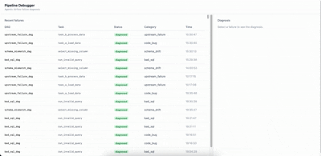

# Agentic Pipeline Debugger

When an Apache Airflow DAG task fails, a LangGraph agent automatically investigates the root cause — fetching task logs, querying Postgres, and reading DAG source code — then produces a structured diagnosis (error category, root cause, evidence, suggested fix) persisted to Postgres and displayed in a React dashboard. All agent runs are traced in LangSmith.



## How it works

```
Airflow on_failure_callback
        ↓
FastAPI POST /trigger
        ↓
LangGraph agent:
  ingest → fetch_logs → classify → investigate → synthesise → persist
        ↓
Postgres (diagnoses table)
        ↓
React dashboard (polls GET /diagnoses every 3s while investigating)
```

The agent classifies failures into one of four categories — `schema_drift`, `bad_sql`, `upstream_failure`, or `code_bug` — then branches its investigation accordingly: querying the Postgres schema, reading DAG source, or checking upstream task states via the Airflow REST API.

## Tech stack

| Layer | Technology |
|---|---|
| Agent | LangGraph + LangSmith |
| Backend | FastAPI + asyncpg + Pydantic |
| Orchestrator | Apache Airflow (Docker Compose) |
| Database | Postgres |
| Frontend | React + TypeScript + Vite + TanStack Query + Tailwind CSS |

## Local setup

### Requirements
- Docker Desktop
- Python 3.11
- Node.js 24+

### 1. Environment variables

```bash
cp .env.example .env
# Fill in ANTHROPIC_API_KEY and LANGSMITH_API_KEY
```

### 2. Start the stack

```bash
docker compose up -d
```

Starts Airflow (webserver + scheduler + worker), Postgres, and FastAPI.

### 3. Frontend

```bash
cd frontend
npm install
npm run dev
```

| Service | URL |
|---|---|
| React dashboard | http://localhost:5173 |
| FastAPI docs | http://localhost:8000/docs |
| Airflow UI | http://localhost:8080 |

Airflow credentials: `airflow` / `airflow`

## Demo DAGs

Three DAGs in `/dags/` trigger intentional failures for demo purposes:

| DAG | Failure mode |
|---|---|
| `schema_mismatch_dag` | SELECTs a column that doesn't exist |
| `bad_sql_dag` | Syntax error in a SQL statement |
| `upstream_failure_dag` | Task B fails because Task A always fails first |

Trigger any DAG from the Airflow UI at `http://localhost:8080` and watch the diagnosis appear in the dashboard within seconds.
